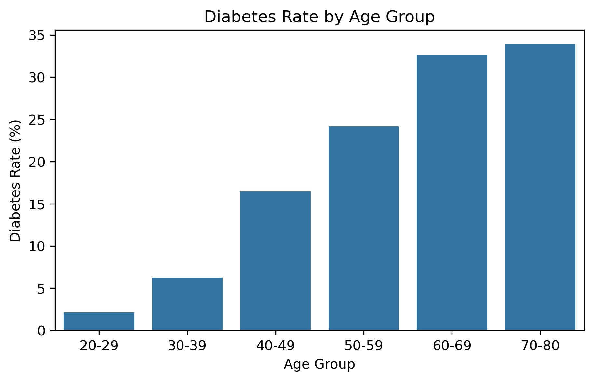
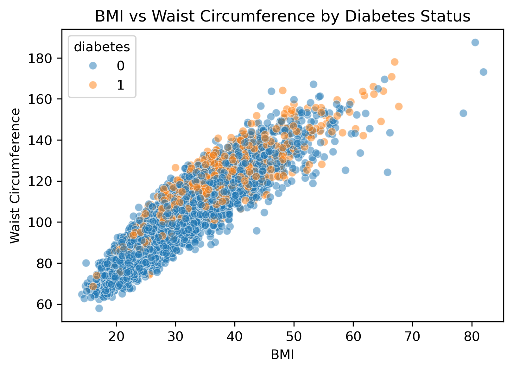
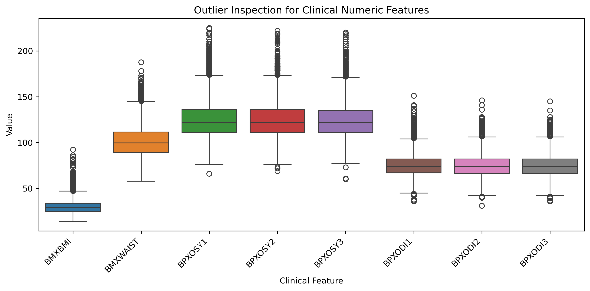
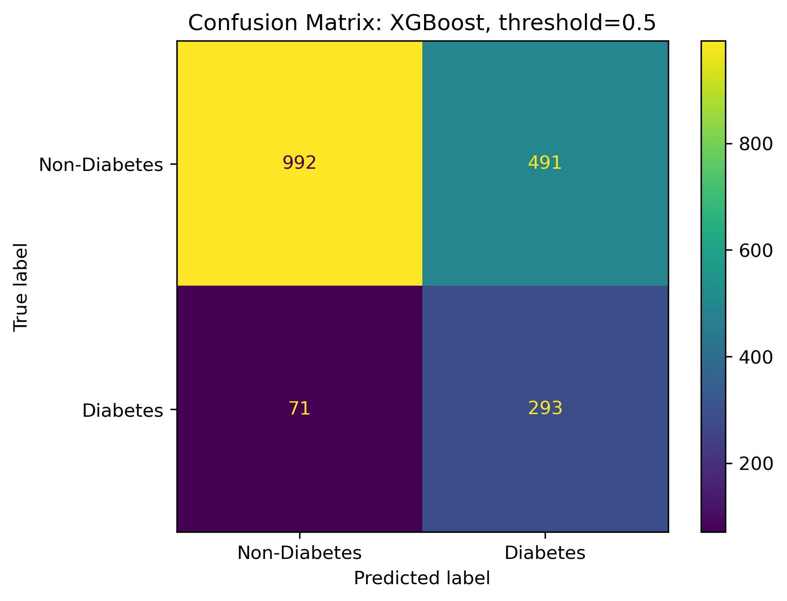
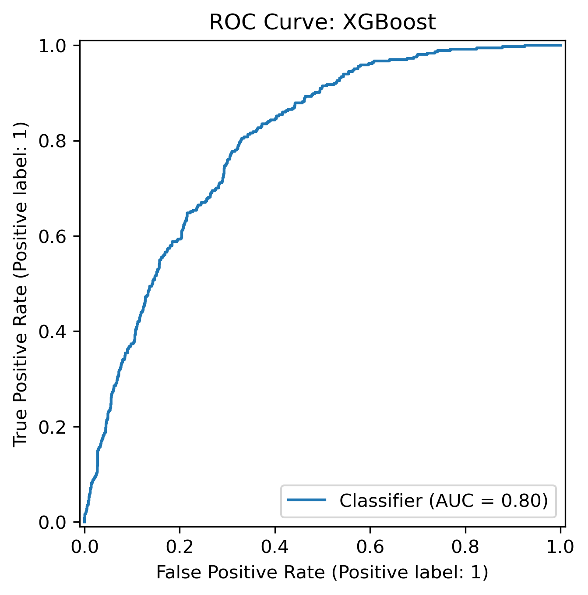
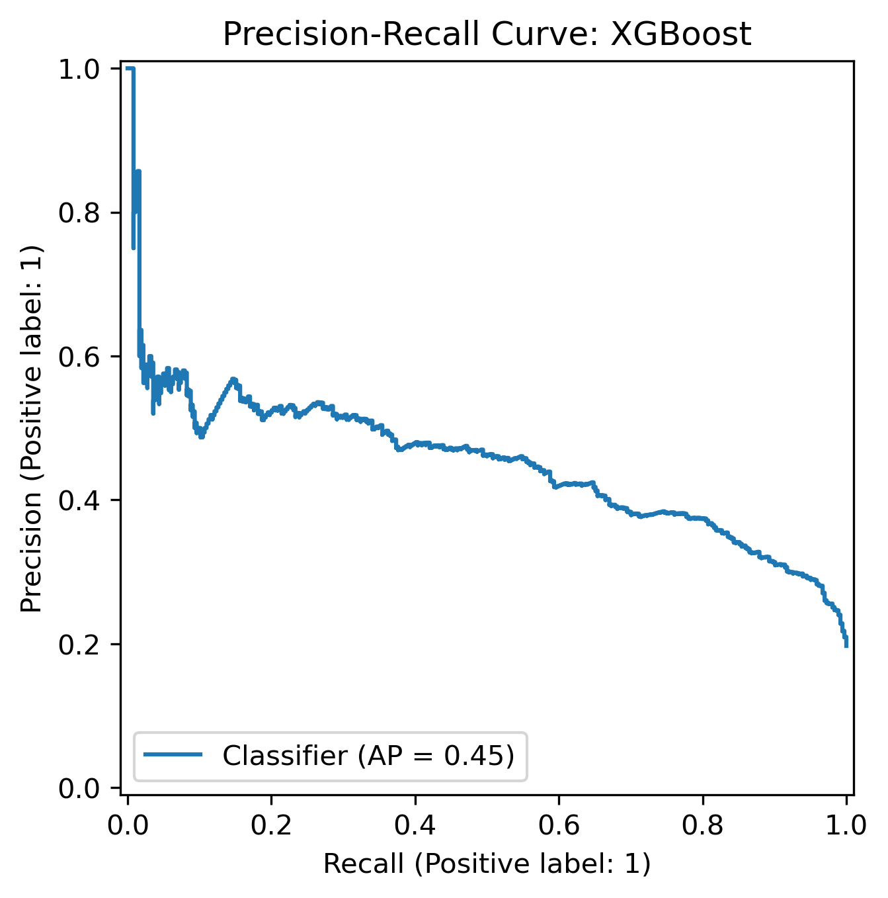
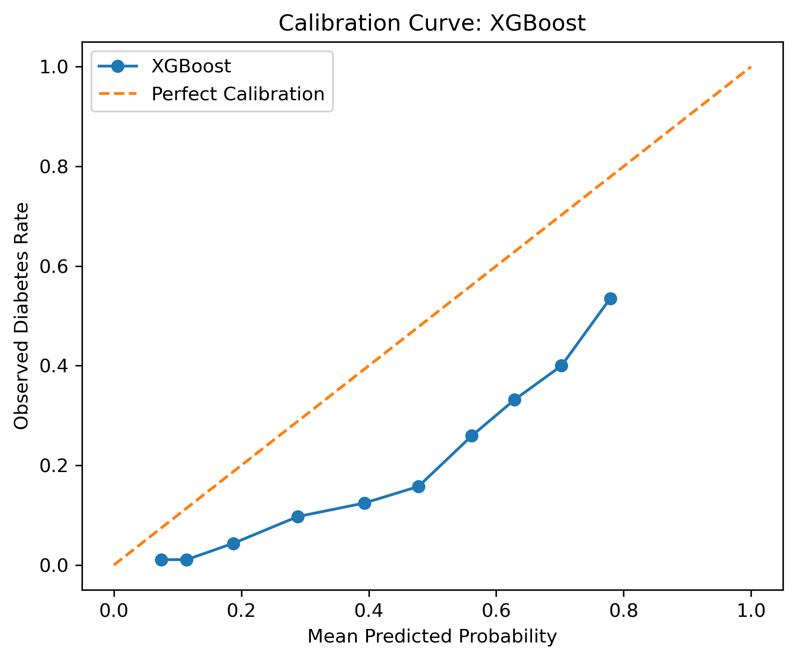
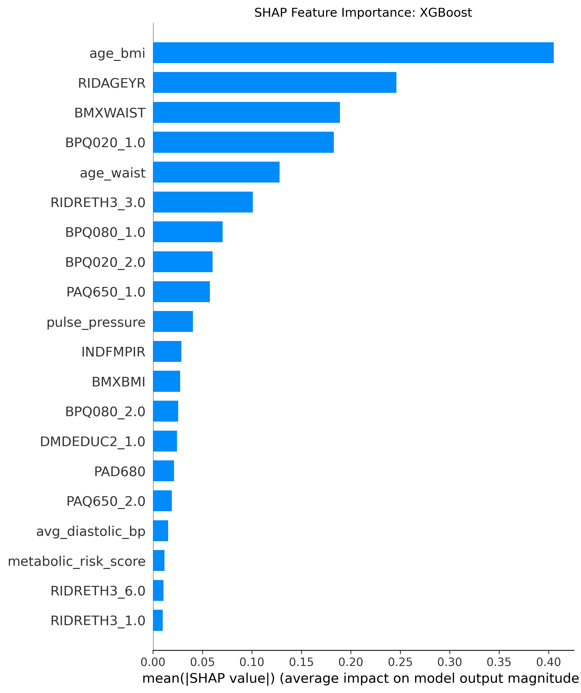
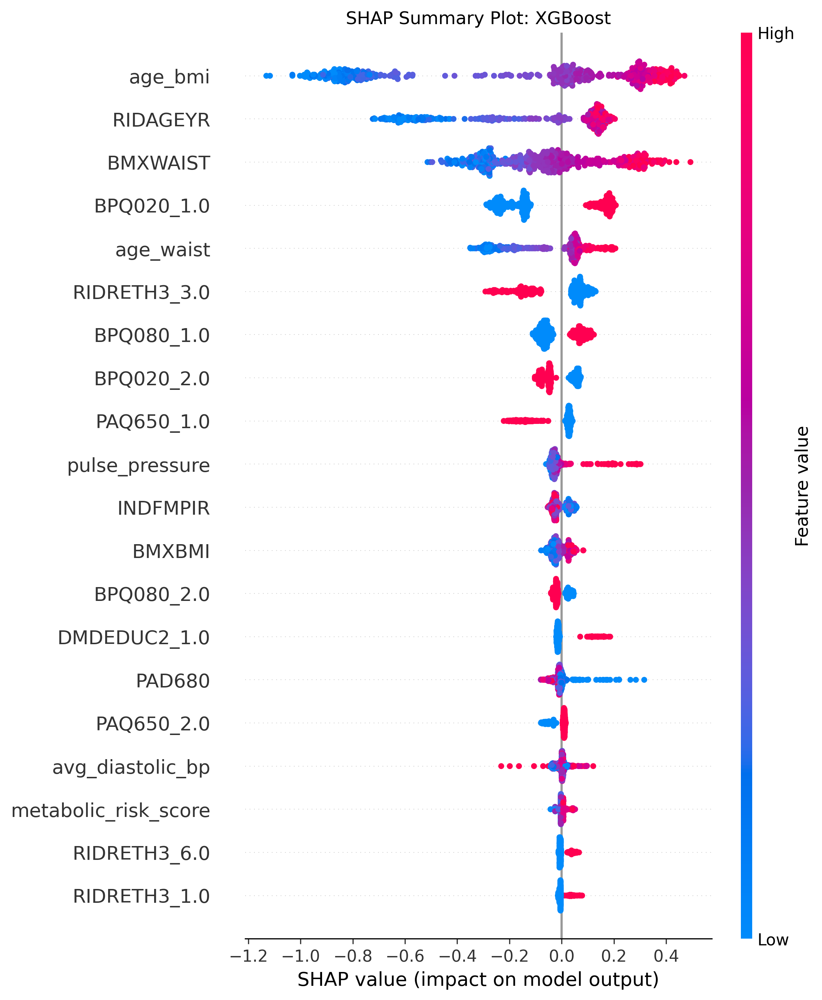

# **Early Diabetes Risk Screening Using Interpretable Machine Learning**

## Project Overview

Diabetes is a major public health concern, and early identification of high-risk individuals can help people take precautionary actions before the condition becomes severe. This project develops a machine learning approach for early diabetes risk screening using NHANES data. The goal is to identify adult participants who may be at higher risk of diabetes using demographic, clinical, body-measurement, and lifestyle-related variables.

This project is designed as a **screening model**, not a diagnostic model. A positive prediction should be interpreted as **predicted high diabetes risk**, meaning the participant may need further clinical evaluation. It should not be interpreted as a confirmed diabetes diagnosis.

Because the dataset is imbalanced, with more non-diabetes participants than diabetes participants, **recall** was selected as the primary performance metric. In a screening setting, recall is important because the goal is to reduce missed diabetes cases.


## Data Sources

The data were collected from the **National Health and Nutrition Examination Survey (NHANES) 2017–March 2020 Pre-Pandemic cycle**. Multiple NHANES files were used and merged using the participant identifier `SEQN`.

The main data sources included:

- Demographics data
- Body measurements data
- Blood pressure examination data
- Glycohemoglobin data
- Fasting glucose data
- Diabetes questionnaire data
- Blood pressure and cholesterol questionnaire data
- Physical activity questionnaire data
- Smoking questionnaire data
- Alcohol use questionnaire data
- Dietary behavior questionnaire data

The diabetes target variable was created using three sources of information:

- Doctor-diagnosed diabetes status
- HbA1c level
- Fasting glucose level

A participant was labeled as diabetes if at least one of the following conditions was satisfied:

- The participant reported doctor-diagnosed diabetes.
- HbA1c was at least 6.5%.
- Fasting glucose was at least 126 mg/dL.


## Repository Structure

```text
early_diabetes_screening/
│
├── data/
│   ├── raw/
│   └── processed/
│
├── notebooks/
|   ├── data_collection.ipynb
|   ├── data_cleaning.ipynb
|   ├── data_assessment.ipynb
|   ├── data_learnability.ipynb 
│   ├── EDA.ipynb
|   ├── data_selection.ipynb
│   ├── feature_engineering.ipynb
│   ├── metric_evaluation.ipynb
│   ├── modeling_baselines.ipynb
│   ├── modeling_experiments.ipynb
│
├── results/
│   ├── eda/
│   ├── final/
|   ├── interpretability/
│   └── modeling/
│
├── artifacts/
│   └── final_xgboost_pipeline.joblib
│
├── data_inventory.md
├── kpis.md
├── data_provenance_log.md
├── model_evaluation_plan.md
├── modeling_plan.md
├── data_audit_and_feature_summary.md
├── requirements.txt
├── .gitignore
└── README.md

```

## Workflow

The project followed the workflow below:

1. Data collection  
2. Data cleaning  
3. Data assessment  
4. Exploratory data analysis  
5. Data selection  
6. Feature engineering  
7. Preprocessing for modeling  
8. Model training and evaluation  
9. Hyperparameter tuning  
10. Model comparison  
11. Final XGBoost evaluation  
12. Error analysis and interpretability  
13. Summary of key findings and conclusions  


# Methodology

## 1. Data Collection

The NHANES files were collected separately and merged using the participant identifier `SEQN`. Each file contributed different types of information, including demographics, clinical measurements, laboratory results, and lifestyle questionnaire responses. After merging, the dataset was filtered to include adult participants only.

The main files used in the project included information from:

- Demographics
- Body measurements
- Blood pressure examination
- HbA1c laboratory results
- Fasting glucose laboratory results
- Diabetes questionnaire
- Blood pressure and cholesterol questionnaire
- Physical activity questionnaire
- Smoking questionnaire
- Alcohol use questionnaire
- Dietary behavior questionnaire


## 2. Data Assessment

The dataset was assessed for:

- Number of participants
- Target class distribution
- Missing values
- Special NHANES missing-value codes
- Duplicate participant IDs
- Distribution of clinical variables
- Potential leakage variables
- Relationships between predictors and diabetes status
- 

## 3. Data Cleaning

Several cleaning steps were applied before modeling. The main cleaning steps included:

- Participants younger than 20 were removed.
- NHANES special missing-value codes were replaced with missing values.
- Rows without enough target information were removed.
- Leakage variables were removed from the predictor set.
- Features with high missingness or low modeling usefulness were reviewed.
- Cleaned and processed data files were saved for modeling.

Examples of NHANES special codes handled include:

| Code | Meaning |
|---|---|
| `7` | Refused |
| `9` | Do not know / unknown |
| `77` | Refused |
| `99` | Do not know / unknown |
| `777` | Refused |
| `999` | Do not know / unknown |

These values were converted to missing values before modeling. After cleaning, the final dataset contained:

| Diabetes Status | Count |
|---|---:|
| Non-diabetes | 7,412 |
| Diabetes | 1,820 |

The final cleaned dataset contained **9,232 adult participants**. The diabetes prevalence was approximately **19.7%**. Because the dataset is imbalanced, accuracy alone was not used as the primary evaluation metric. Instead, recall, PR-AUC, ROC-AUC, balanced accuracy, F1-score, precision, and accuracy were reviewed.


## 4. Exploratory Data Analysis

Exploratory data analysis was used to understand the dataset before modeling.

The main EDA questions were:

- What is the diabetes class distribution?
- How does diabetes rate vary by age group?
- How are BMI and waist circumference related?
- Are there important missingness patterns?
- Are there outliers in clinical variables?
- Which variables appear clinically meaningful for diabetes screening?

### Diabetes Rate by Age Group



The diabetes rate increased across older age groups. This supports the importance of age as a predictor in diabetes risk screening.

### BMI and Waist Circumference



BMI and waist circumference showed a strong positive relationship. Diabetes cases appeared more frequently among participants with higher BMI and higher waist circumference.

### Outlier Inspection



Outlier inspection was performed for important clinical variables, including BMI, waist circumference, and blood pressure measurements. Some high values were observed, but they were not automatically removed because they may represent real participants rather than data errors.


## 5. Data Selection

The predictor set was selected carefully to avoid leakage and retain clinically meaningful variables. Several features were removed before modeling for leakage, redundancy, missingness, or low relevance.

### Leakage Features

The following variables were removed because they directly define or strongly reveal the target variable:

| Dropped Feature | Reason |
|---|---|
| `diabetes` | Target variable, not a predictor |
| `doctor_diabetes` | Used to construct the target |
| `DIQ010` | Doctor diagnosis variable used to construct the target |
| `LBXGH` | HbA1c value used to construct the target |
| `LBXGLU` | Fasting glucose value used to construct the target |

These variables were removed to avoid target leakage. Keeping them would make the prediction task unrealistic because the model would have direct access to diagnostic information.

### Identifier Feature

| Dropped Feature | Reason |
|---|---|
| `SEQN` | Participant identifier; not clinically meaningful for prediction |

`SEQN` was removed because it is only an ID number and does not contain useful predictive information.

### Redundant Blood-Pressure Features

The original repeated blood-pressure readings were summarized into average blood-pressure features.

| Original Features | Replacement Feature |
|---|---|
| `BPXOSY1`, `BPXOSY2`, `BPXOSY3` | `avg_systolic_bp` |
| `BPXODI1`, `BPXODI2`, `BPXODI3` | `avg_diastolic_bp` |

The repeated readings were not all used separately in the final modeling dataset because average systolic and average diastolic blood pressure provide cleaner summary measures.

### High-Missingness or Low-Information Physical Activity Features

Some physical activity duration variables were removed because they had high missingness and were less reliable for modeling.

| Dropped Feature | Reason |
|---|---|
| `PAD660` | High missingness / less reliable duration variable |
| `PAD675` | High missingness / less reliable duration variable |
| `PAQ655` | High missingness / less reliable activity variable |
| `PAQ670` | High missingness / less reliable activity variable |

Instead of relying on these detailed duration variables, simpler physical activity indicators were retained or engineered.


## 6. Engineered Features and Rationale

Several engineered features were created using domain knowledge related to diabetes risk.

### Blood-Pressure Features

| Engineered Feature | Rationale |
|---|---|
| `avg_systolic_bp` | Average systolic blood pressure across available readings |
| `avg_diastolic_bp` | Average diastolic blood pressure across available readings |
| `pulse_pressure` | Difference between systolic and diastolic blood pressure |
| `high_bp_exam` | Indicator for elevated measured blood pressure |

These features summarize blood-pressure information and help capture cardiovascular risk factors related to diabetes.

### Body-Size Features

| Engineered Feature | Rationale |
|---|---|
| `obese` | Indicator for BMI-based obesity |
| `bmi_category` | Categorizes BMI into clinically interpretable groups |
| `high_waist` | Indicator for high waist circumference |
| `age_bmi` | Interaction between age and BMI |
| `age_waist` | Interaction between age and waist circumference |

These features were created because obesity, central adiposity, and age-related body-size risk are clinically meaningful for diabetes screening.

### Lifestyle and Health Behavior Features

| Engineered Feature | Rationale |
|---|---|
| `physically_active` | Captures whether the participant reported physical activity |
| `smoking_history` | Captures smoking-related risk information |
| `ever_regular_alcohol` | Captures alcohol-use history |
| `fair_poor_diet` or `fair_or_poor_diet` | Captures lower self-reported diet quality |
| `frequent_fast_food` | Captures frequent fast-food consumption behavior |

These features were included because lifestyle and health behavior factors may contribute to diabetes risk.

### Interaction and Risk Score Features

| Engineered Feature | Rationale |
|---|---|
| `age_systolic_bp` | Interaction between age and systolic blood pressure |
| `metabolic_risk_score` | Simple combined score based on obesity, waist, blood pressure, smoking, and diet-related indicators |

The metabolic risk score was created to summarize multiple diabetes-related risk indicators into one interpretable feature.

### Missingness Indicator Features

Missingness indicators were added for selected important predictors.

| Engineered Feature | Rationale |
|---|---|
| `avg_systolic_bp_missing` | Indicates whether systolic BP information was missing |
| `avg_diastolic_bp_missing` | Indicates whether diastolic BP information was missing |
| `BMXWAIST_missing` | Indicates whether waist circumference was missing |
| `ALQ121_missing` | Indicates whether alcohol frequency information was missing |
| `ALQ130_missing` | Indicates whether alcohol quantity information was missing |

These features were added because missingness itself may contain useful information. The model can learn whether missing values are associated with different risk patterns.

### Blood Pressure Features

| Engineered Feature | Rationale |
|---|---|
| `avg_systolic_bp` | Average systolic blood pressure across available readings |
| `avg_diastolic_bp` | Average diastolic blood pressure across available readings |
| `pulse_pressure` | Difference between systolic and diastolic blood pressure |
| `high_bp_exam` | Indicator for elevated measured blood pressure |

These features summarize blood pressure information and capture cardiovascular risk factors related to diabetes.

### Body-Size Features

| Engineered Feature | Rationale |
|---|---|
| `obese` | Indicator for BMI-based obesity |
| `bmi_category` | Clinically interpretable BMI category |
| `high_waist` | Indicator for high waist circumference |
| `age_bmi` | Interaction between age and BMI |
| `age_waist` | Interaction between age and waist circumference |

These features were created because obesity, central adiposity, and age-related body-size risk are clinically meaningful for diabetes screening.

### Lifestyle Features

| Engineered Feature | Rationale |
|---|---|
| `physically_active` | Captures whether the participant reported physical activity |
| `smoking_history` | Captures smoking-related risk information |
| `ever_regular_alcohol` | Captures alcohol-use history |
| `fair_poor_diet` or `fair_or_poor_diet` | Captures lower self-reported diet quality |
| `frequent_fast_food` | Captures frequent fast-food consumption behavior |

Lifestyle variables were included because physical activity, smoking, diet, and alcohol behavior may be associated with diabetes risk.

### Risk Summary Feature

A simple `metabolic_risk_score` was created using selected risk indicators such as:

- Obesity
- High waist circumference
- High blood pressure
- Smoking history
- Diet-related risk

This feature was designed to summarize multiple diabetes-related risk indicators into one interpretable score.

### Missingness Indicator Features

Missingness indicators were added for selected important predictors, including:

- Blood pressure variables
- Waist circumference
- Alcohol-related variables

These indicators allow the model to learn whether missingness itself contains useful information.


## 7. Preprocessing for Modeling

A preprocessing pipeline was used to ensure consistent treatment of numeric and categorical variables.

Numeric variables were processed using:

- Median imputation
- Standard scaling

Categorical variables were processed using:

- Most frequent category imputation
- One-hot encoding

The preprocessing steps were included inside the modeling pipeline. This prevents data leakage because imputation, scaling, and encoding were learned only from the training data during cross-validation and final model evaluation.


## 8. Model Training and Evaluation

The data were split into training and test sets using an 80/20 stratified split. Stratification was used to preserve the diabetes/non-diabetes class ratio in both training and test sets. Models were evaluated using stratified cross-validation on the training set. The main evaluation metrics were:

- Recall
- PR-AUC
- ROC-AUC
- Balanced accuracy
- F1-score
- Precision
- Accuracy

Recall was treated as the primary KPI because this project focuses on early diabetes risk screening. In this setting, missing actual diabetes cases is more concerning than producing some false positives.

Accuracy was reported for reference, but it was not used as the main model-selection metric because the dataset is imbalanced.


## 9. Hyperparameter Tuning 

Three simple baseline models were evaluated first:

- Dummy Classifier
- Logistic Regression
- Decision Tree

The Dummy Classifier was used as a majority-class reference model. Logistic Regression was used as a simple and interpretable linear baseline. Decision Tree was used as a simple nonlinear baseline that can capture basic feature interactions. These baseline models provided a reference point before moving to more complex models.

Advanced models were tuned using cross-validation. Hyperparameter tuning was performed only on the training data. The tuned models included:

- Regularized Logistic Regression
- Random Forest
- Gradient Boosting
- XGBoost

The tuning process used recall as the refit metric because recall was the primary KPI for this screening problem. The final holdout test set was not used during hyperparameter tuning. It was used only for final model evaluation after model selection was complete.


## 10. Model Comparison

The following table summarizes cross-validated model performance.

| Model | Recall | PR-AUC | ROC-AUC | Balanced Accuracy | F1-score | Precision | Accuracy |
|---|---:|---:|---:|---:|---:|---:|---:|
| Dummy Classifier | 0.0000 | 0.1972 | 0.5000 | 0.5000 | 0.0000 | 0.0000 | 0.8028 |
| Logistic Regression | 0.7520 | 0.4800 | 0.8054 | 0.7300 | 0.5114 | 0.3875 | 0.7167 |
| Decision Tree | 0.7555 | 0.4007 | 0.7635 | 0.7028 | 0.4752 | 0.3471 | 0.6708 |
| Regularized Logistic Regression | 0.7582 | 0.4795 | 0.8058 | 0.7319 | 0.5127 | 0.3874 | 0.7159 |
| Random Forest | 0.7733 | 0.4680 | 0.7941 | 0.7212 | 0.4955 | 0.3646 | 0.6896 |
| Gradient Boosting | 0.2603 | 0.4698 | 0.7982 | 0.6027 | 0.3506 | 0.5377 | 0.8100 |
| XGBoost | 0.7953 | 0.4759 | 0.7993 | 0.7306 | 0.5041 | 0.3690 | 0.6914 |

XGBoost achieved the highest cross-validated recall and was selected as the final model.

Regularized Logistic Regression had slightly stronger values for some secondary metrics, such as PR-AUC, ROC-AUC, F1-score, and precision. However, XGBoost was selected because recall was the primary KPI and the main project goal was early diabetes risk screening.


## 11. Tuned XGBoost Summary

XGBoost was selected as the final model because it achieved the highest recall during cross-validation. The final XGBoost model was evaluated on the holdout test set using threshold `0.50`.

| Model | Threshold | Recall | Precision | F1-score | PR-AUC | ROC-AUC | Balanced Accuracy | Accuracy |
|---|---:|---:|---:|---:|---:|---:|---:|---:|
| XGBoost | 0.50 | 0.8049 | 0.3737 | 0.5105 | 0.4513 | 0.7975 | 0.7369 | 0.6957 |

The final model identified about **80.5%** of diabetes cases in the holdout test set. The diabetes precision was lower, meaning that the model also produced false positives. This tradeoff is acceptable for a screening model, but it means the model should not be used as a diagnostic tool.


## 12. Final Model Evaluation

### Confusion Matrix



The confusion matrix showed that the model correctly identified many diabetes cases, but it also flagged some non-diabetes participants as high risk. This behavior is expected because the project prioritized recall for early screening.

### ROC Curve



The ROC curve shows the model's ability to separate diabetes and non-diabetes participants across different classification thresholds.

### Precision-Recall Curve



The precision-recall curve is especially important because the dataset is imbalanced. It helps evaluate the tradeoff between identifying diabetes cases and controlling false positives.

### Calibration Curve



The calibration curve showed that the XGBoost model's predicted probabilities were not perfectly calibrated and tended to overestimate diabetes risk. Therefore, predicted probabilities should be interpreted as relative screening scores rather than exact clinical risk probabilities.


## 13. Interpretability

Model interpretability was evaluated using:

- XGBoost feature importance
- SHAP summary plot
- SHAP feature importance table

### SHAP Summary Plot



The most important features included age-related variables, BMI-related variables, waist circumference, blood-pressure-related variables, and metabolic risk features. These results are clinically reasonable because diabetes risk is strongly associated with age, body-size measures, and metabolic health indicators.



The plot shows that higher values of age_bmi, RIDAGEYR, BMXWAIST, and age_waist generally pushed predictions toward higher diabetes risk. This is clinically reasonable because older age, higher BMI, and larger waist circumference are associated with increased diabetes risk.

Blood-pressure-related variables also had important effects. For example, BPQ020_1.0 tended to push predictions toward diabetes risk, while BPQ020_2.0 tended to push predictions in the opposite direction. This suggests that self-reported high blood pressure status was important for the XGBoost model.

Some one-hot encoded categorical features, such as RIDRETH3_3.0, BPQ080_1.0, PAQ650_1.0, DMDEDUC2_1.0, and RIDRETH3_6.0, should be interpreted carefully. For these variables, a high value means that the participant belongs to that category, while a low value means that the participant does not belong to that category. Therefore, their SHAP values represent the model effect of being in that category compared with other categories.

Overall, the SHAP plot supports the model interpretation by showing that age, BMI-related interaction terms, waist circumference, blood-pressure history, physical activity variables, and demographic indicators contributed to the final XGBoost predictions.

## 14. Error Analysis

Error analysis was performed using:

- Classification report
- Confusion matrix
- False positive and false negative review
- Subgroup error analysis

The final model had high diabetes recall but lower precision. This means the model identified most diabetes cases but also flagged some non-diabetes participants as high risk.

Subgroup analysis showed that model performance varied across some demographic groups. Some lower-recall groups had diabetes cases with weaker visible risk patterns, such as lower BMI, lower waist circumference, or lower metabolic risk score. This suggests that the model performs better when diabetes risk patterns are more visible in the available predictors.


## Key Findings and Conclusions

The main findings from this project are:

1. The dataset is imbalanced, so accuracy alone is not a reliable model-selection metric.
2. Diabetes rate increases across older age groups.
3. BMI and waist circumference are strongly related and clinically important.
4. XGBoost achieved the highest recall among the evaluated models.
5. The final XGBoost model identified about 80.5% of diabetes cases on the holdout test set.
6. The model produced false positives, which is acceptable for screening but limits diagnostic use.
7. SHAP analysis showed that age, BMI-related features, waist circumference, blood pressure, and metabolic risk features were important predictors.
8. The calibration curve showed that predicted probabilities should be interpreted as relative screening scores, not exact clinical risk probabilities.
9. The model should be used only as a risk-screening tool, not as a clinical diagnosis tool.

Overall, this project shows that machine learning can support early diabetes risk screening using demographic, clinical, and lifestyle-related NHANES variables.


## Limitations

This project has several limitations:

- False positives are present because recall was prioritized.
- Some diabetes cases may be missed, especially when visible risk indicators are weak.
- NHANES is cross-sectional, so the model does not predict future diabetes onset over time.
- The predicted probabilities are not perfectly calibrated.
- External validation on another dataset would be needed before real-world use.


## Future Work

Future improvements could include:

- Probability calibration
- More detailed subgroup fairness analysis
- Additional clinically meaningful feature engineering
- External validation on another dataset
- Comparison with more advanced threshold-selection strategies
- Development of a simple deployment interface for screening demonstration


## References
1. Kutlu, M., Donmez, T.B. and Freeman, C., 2024. Machine learning interpretability in diabetes risk assessment: A SHAP analysis. Computers and Electronics in Medicine, 1(1), pp.34-44.
2. Rastogi, R. and Bansal, M., 2023. Diabetes prediction model using data mining techniques. Measurement: Sensors, 25, p.100605.
3. Kaur, H. and Kumari, V., 2022. Predictive modelling and analytics for diabetes using a machine learning approach. Applied computing and informatics, 18(1-2), pp.90-100.
4. Mujumdar, A. and Vaidehi, V., 2019. Diabetes prediction using machine learning algorithms. Procedia computer science, 165, pp.292-299.
5. Khanam, J.J. and Foo, S.Y., 2021. A comparison of machine learning algorithms for diabetes prediction. Ict Express, 7(4), pp.432-439.
6. Sarwar, M.A., Kamal, N., Hamid, W. and Shah, M.A., 2018, September. Prediction of diabetes using machine learning algorithms in healthcare. In 2018 24th international conference on automation and computing (ICAC) (pp. 1-6). IEEE.
7. Febrian, M.E., Ferdinan, F.X., Sendani, G.P., Suryanigrum, K.M. and Yunanda, R., 2023. Diabetes prediction using supervised machine learning. Procedia Computer Science, 216, pp.21-30.
8. Jaiswal, V., Negi, A. and Pal, T., 2021. A review on current advances in machine learning based diabetes prediction. Primary Care Diabetes, 15(3), pp.435-443.

